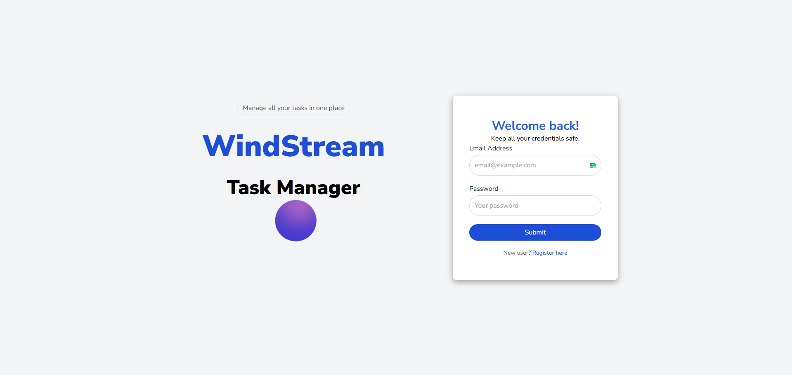
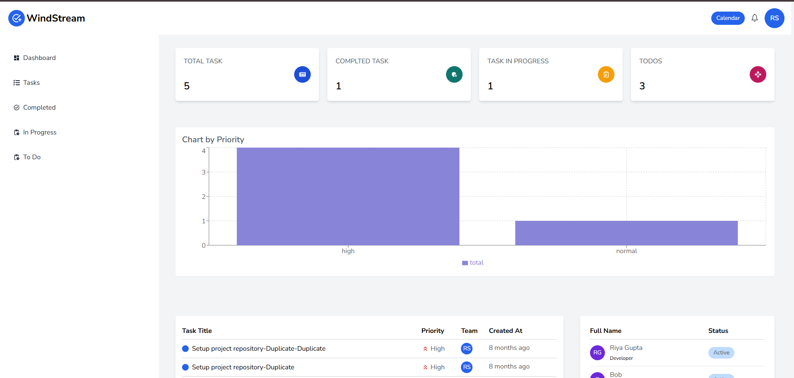
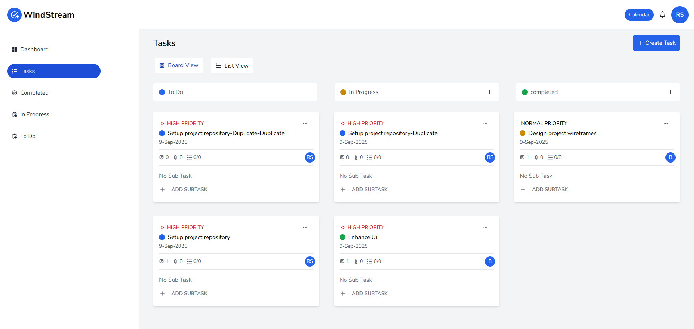
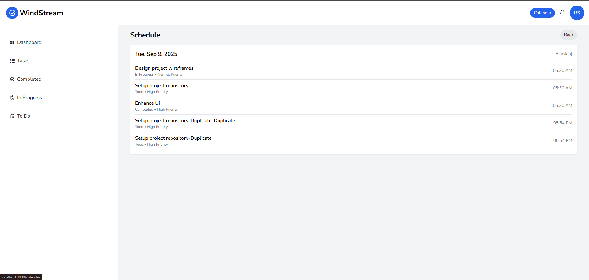

# WindStream – Full-Stack Team Task Manager

## 🚀 Overview

WindStream is a production-ready full-stack MERN task management platform that enables teams to collaborate, manage workflows, track progress, and monitor productivity through dashboards, notifications, calendars, and role-based administration.

The application supports secure JWT authentication, Kanban-style task management, dashboard analytics, activity tracking, team collaboration, and admin controls — all built using the MERN stack.

---

## 🌐 Live Demo

* **Frontend (Netlify):**
  https://windstreamm.netlify.app/

* **Backend API (Render):**
  https://windstream-backend.onrender.com

---

## 🧪 Demo Credentials

### Admin Access

```txt
Email: admin@gmail.com
Password: 123456
```

### User Access

```txt
Email: raghav@gmail.com
Password: Raghav1234
```

---

# 📸 Screenshots

## Login Page



## Dashboard



## Task Board



## Calendar View




---

# ✨ Key Features

## 🔐 Authentication & Authorization

* Secure JWT authentication using HTTP-only cookies
* Login, logout, registration functionality
* Protected routes for authenticated users
* Role-based access control (Admin/User)

## 📋 Task Management

* Create, update, delete, duplicate tasks
* Drag-and-drop Kanban workflow
* Task stages:

  * Todo
  * In Progress
  * Completed
* Task priority management
* Soft delete and restore functionality

## 📊 Dashboard & Analytics

* Task summary statistics
* Priority distribution charts
* Team performance overview
* Recent activity tracking

## 👥 Team Collaboration

* Team member management
* Task assignment system
* Activity logs
* Notifications system

## 📅 Calendar Integration

* Tasks grouped by due dates
* Calendar-based task visualization

## 🗑️ Trash Management

* Restore deleted tasks
* Permanently remove tasks (Admin only)

---

# 🛠️ Tech Stack

## Frontend

* React.js
* Vite
* React Router DOM
* Redux Toolkit
* RTK Query
* Tailwind CSS
* React Hook Form
* Recharts
* React Toastify

## Backend

* Node.js
* Express.js
* MongoDB
* Mongoose

## Authentication

* JWT Authentication
* HTTP-only cookies
* bcrypt password hashing

## Deployment

* Netlify (Frontend)
* Render (Backend)
* MongoDB Atlas (Database)

---

# 🧠 Engineering Highlights

* Built scalable REST APIs using Express and MongoDB
* Implemented JWT authentication with secure HTTP-only cookies
* Integrated Redux Toolkit Query for optimized API state management and caching
* Designed fully responsive UI using Tailwind CSS
* Added protected routes and role-based authorization
* Implemented task activity tracking and notifications system
* Managed production deployment using Render + Netlify + MongoDB Atlas
* Configured CORS and cookie-based authentication for production environments

---

# 🏗️ System Architecture

```txt
React Frontend (Netlify)
           ↓
Express REST API (Render)
           ↓
MongoDB Atlas Database
```

---

# 📁 Project Structure

```bash
WindStream/
├── client/                 # React Frontend
│   ├── src/
│   ├── public/
│   └── package.json
│
├── server/                 # Express Backend
│   ├── controllers/
│   ├── routes/
│   ├── models/
│   ├── middlewares/
│   ├── utils/
│   └── package.json
│
└── README.md
```

---

# 🔌 API Endpoints

## Authentication & Users

| Method | Endpoint               | Access |
| ------ | ---------------------- | ------ |
| POST   | `/api/login`           | Public |
| POST   | `/api/register`        | Public |
| POST   | `/api/logout`          | User   |
| GET    | `/api/get-team`        | Admin  |
| GET    | `/api/notifications`   | User   |
| PUT    | `/api/profile`         | User   |
| PUT    | `/api/change-password` | User   |

---

## Tasks

| Method | Endpoint                       | Access |
| ------ | ------------------------------ | ------ |
| GET    | `/api/task`                    | User   |
| POST   | `/api/task/create`             | Admin  |
| PUT    | `/api/task/update/:id`         | Admin  |
| DELETE | `/api/task/delete-restore/:id` | Admin  |
| GET    | `/api/task/dashboard`          | User   |

---

# ⚙️ Environment Variables

## Backend (`server/.env`)

```env
PORT=5000
MONGODB_URI=your_mongodb_connection_string
JWT_SECRET=your_secret_key
NODE_ENV=development
```

---

## Frontend (`client/.env`)

```env
VITE_APP_BASE_URL=http://localhost:5000
```

---

# 💻 Running Locally

## Clone Repository

```bash
git clone https://github.com/your-username/windstream.git
cd windstream
```

---

## Backend Setup

```bash
cd server
npm install
npm run dev
```

Backend runs on:

```txt
http://localhost:5000
```

---

## Frontend Setup

```bash
cd client
npm install
npm run dev
```

Frontend runs on:

```txt
http://localhost:3000
```

---

# 🚀 Deployment

## Frontend Deployment (Netlify)

* Root Directory: `client`
* Build Command:

```bash
npm run build
```

* Publish Directory:

```txt
dist
```

---

## Backend Deployment (Render)

* Root Directory: `server`
* Build Command:

```bash
npm install
```

* Start Command:

```bash
npm start
```

---

# 📚 Challenges & Learnings

* Solved CORS and cookie-authentication issues during production deployment
* Learned secure JWT authentication using HTTP-only cookies
* Implemented scalable API architecture using Express and MongoDB
* Optimized frontend API handling with RTK Query caching
* Improved state management using Redux Toolkit
* Managed separate frontend/backend deployments with environment configurations

---

# 📌 Future Improvements

* Real-time notifications using Socket.IO
* Drag-and-drop Kanban interactions
* File/image attachments in tasks
* Team chat system
* Dark mode support
* Email notifications

---

# 👨‍💻 Author

**Pranav Arora**

* GitHub: https://github.com/PranavArora20/WindStream
* LinkedIn: https://www.linkedin.com/in/pranav-arora-09b7021b1/

---

# ⭐ If you like this project

Give this repository a star ⭐ on GitHub.
